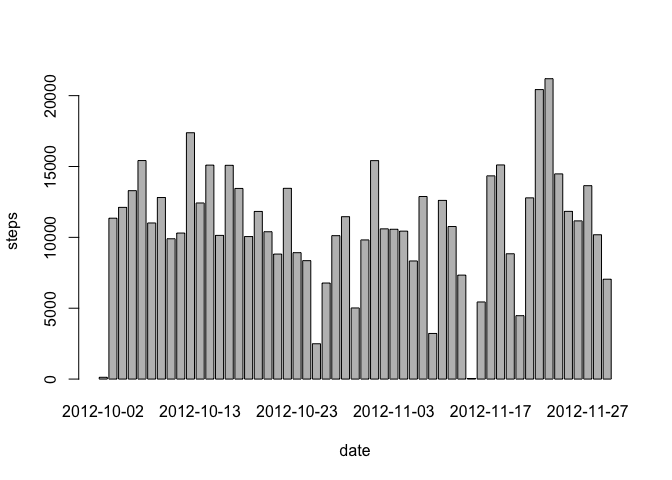
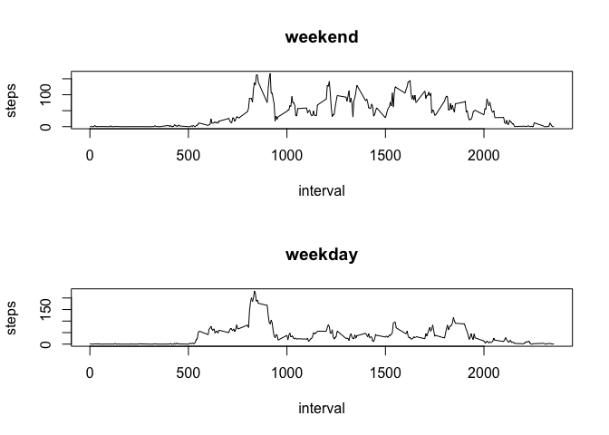

# Reproducible Research: Peer Assessment 1


## Loading and preprocessing the data
Using the activities.csv file found with our course, we'll load the data into a variable called 'data'.

The variables included in this dataset are:

1. steps: Number of steps taking in a 5-minute interval (missing values are coded as NA )
2. date: The date on which the measurement was taken in YYYY-MM-DD format
3. interval: Identifier for the 5-minute interval in which measurement was taken


```r
data = read.csv('activity.csv', header = T)
names(data)
```

```
## [1] "steps"    "date"     "interval"
```

Lets see what is in this dataset by using str


```r
str(data)
```

```
## 'data.frame':	17568 obs. of  3 variables:
##  $ steps   : int  NA NA NA NA NA NA NA NA NA NA ...
##  $ date    : Factor w/ 61 levels "2012-10-01","2012-10-02",..: 1 1 1 1 1 1 1 1 1 1 ...
##  $ interval: int  0 5 10 15 20 25 30 35 40 45 ...
```

```r
head(data)
```

```
##   steps       date interval
## 1    NA 2012-10-01        0
## 2    NA 2012-10-01        5
## 3    NA 2012-10-01       10
## 4    NA 2012-10-01       15
## 5    NA 2012-10-01       20
## 6    NA 2012-10-01       25
```


## What is mean total number of steps taken per day?

Building a histogram of total number of steps taken each day. 

Using the aggregate function we'll ready the data for the histagram. Then we will produce the histogram.

1. Histogram

```r
step_date <- aggregate(steps ~ date, data = data, FUN = sum)
barplot(step_date$steps, names.arg = step_date$date, xlab = "date", ylab = "steps")
```

 
2. Median and Mean of total steps taken per day

```r
mean(step_date$steps)
```

```
## [1] 10766.19
```

```r
median(step_date$steps)
```

```
## [1] 10765
```

## What is the average daily activity pattern?
Make a time series plot (i.e. type = "l") of the 5-minute interval (x-axis) and the average number of steps taken, averaged across all days (y-axis)

```r
step_interval <- aggregate(steps ~ interval, data = data, FUN = mean)
plot(step_interval, type = "l")
```

 

Which 5-minute interval, on average across all the days in the dataset, contains the maximum number of steps?

```r
step_interval$interval[which.max(step_interval$steps)]
```

```
## [1] 835
```

## Imputing missing values
Calculate and report the total number of missing values in the dataset (i.e. the total number of rows with NAs)


```r
sum(is.na(data))
```

```
## [1] 2304
```

Devise a strategy for filling in all of the missing values in the dataset. The strategy does not need to be sophisticated. For example, you could use the mean/median for that day, or the mean for that 5-minute interval, etc.

For this we will use our earlier interval steps mean data in the step_interval variable. This will fix our ealier data frame by updating NA's with averagess.


```r
data <- merge(data, step_interval, by = "interval", suffixes = c("", 
    ".y"))
nas <- is.na(data$steps)
data$steps[nas] <- data$steps.y[nas]
data <- data[, c(1:3)]
```

Make a histogram of the total number of steps taken each day and Calculate and report the mean and median total number of steps taken per day. Do these values differ from the estimates from the first part of the assignment? What is the impact of imputing missing data on the estimates of the total daily number of steps?


```r
step_date <- aggregate(steps ~ date, data = data, FUN = sum)
barplot(step_date$steps, names.arg = step_date$date, xlab = "date", ylab = "steps")
```

 

## Are there differences in activity patterns between weekdays and weekends?

Create a new factor variable in the dataset with two levels -- "weekday" and "weekend" indicating whether a given date is a weekday or weekend day.


```r
whichdays <- function(date) {
    if (weekdays(as.Date(date)) %in% c("Saturday", "Sunday")) {
        "weekend"
    } else {
        "weekday"
    }
}
data$whichdays <- as.factor(sapply(data$date, whichdays))
```

Make a panel plot containing a time series plot (i.e. type = "l") of the 5-minute interval (x-axis) and the average number of steps taken, averaged across all weekday days or weekend days (y-axis).


```r
par(mfrow = c(2, 1))
for (type in c("weekend", "weekday")) {
    step_type <- aggregate(steps ~ interval, data = data, subset = data$whichdays == 
        type, FUN = mean)
    plot(step_type, type = "l", main = type)
}
```

 

